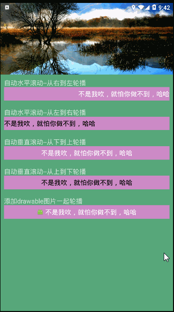

# Android文字轮播控件
[](http://www.apache.org/licenses/LICENSE-2.0.html)


现在的绝大数APP特别是类似淘宝京东等这些大型APP都有文字轮播界面，实现循环轮播多个广告词等功能；这种控件俗称“跑马灯”，而TextBannerView已经实现了可垂直跑、可水平跑的跑马灯了。


## 效果图


[Download Apk](https://github.com/zsml2016/TextBannerView/releases/download/1.0.2/demo-1.0.2.apk)


## <a name="1"></a>Attributes属性（TextBannerView布局文件中调用）
|Attributes|format|describe
|---|---|---|
|setInterval| integer |文字切换时间间隔,默认3000
|setAnimDuration| integer |动画持续时间，默认1500
|setTextSize| dimension |设置文字尺寸
|setTextColor| color |设置文字颜色,默认黑色
|setSingleLine| boolean|是否为显示单行
|setGravity| |文字显示位置,默认左边居中；可设置left、center、right
|setDirection| |文字轮播方向，默认水平从右到左轮播：right_to_left；还可以设置left_to_right（从左到右轮播）、bottom_to_top（从底部到顶部轮播）、top_to_bottom（从顶部到底部轮播）
|setFlags| |添加文字下划线、中划线。默认没有划线；可设置underline(下划线)、strike(中划线)。<br>支持版本：v1.0.4开始
|setTypeface| |设置字体样式类型，如加粗、斜体、斜体加粗。默认为普通类型；可设置bold(加粗)、italic(斜体)、italic_bold(斜体加粗)。<br>支持版本：v1.0.4开始


## <a name="2"></a>方法
|方法名|描述|版本限制
|---|---|---|
|setDatas(List<String> datas)| 设置数据，类型：List<String>|无
|startViewAnimator()| 设置开始文字切换（默认自动）|无
|stopViewAnimator()| 设置暂停文字切换|无
|setItemOnClickListener(listener)| 设置点击监听事件回调 |无
|setDatasWithDrawableIcon()| 设置带图标的数据；第一个参数：数据 。第二参数：drawable.  第三参数drawable尺寸。第四参数图标位置(仅支持Gravity.LEFT、Gravity.TOP、Gravity.RIGHT、Gravity.BOTTOM) |1.0.2开始


## 使用步骤

#### Step 1.依赖TextBannerView
Gradle 
```groovy
dependencies{
    compile 'com.superluo:textbannerview:1.0.5'  //最新版本
}
```
或者引用本地lib
```groovy
compile project(':textbannerlibrary')
```

Maven
```xml
<dependency>
  <groupId>com.superluo</groupId>
  <artifactId>textbannerview</artifactId>
  <version>1.0.5</version>
  <type>pom</type>
</dependency>
```

#### Step 2.在布局文件中添加TextBannerView，可以设置自定义属性

```xml
<com.superluo.textbannerlibrary.TextBannerView
        android:id="@+id/tv_banner"
        android:layout_width="match_parent"
        android:layout_height="38dp"
        android:background="#cc8ac6"
        app:setGravity="right"
        app:setTextColor="#fff"/>
```
* <a href="#1">点击可参考更多自定义属性</a>


#### Step 3.在Activity或者Fragment中配置TextBannerView 


```java
//初始化TextBannerView
TextBannerView tvBanner = (TextBannerView) findViewById(R.id.tv_banner);

//设置数据
List<String> list = new ArrayList<>();

list.add("学好Java、Android、C#、C、ios、html+css+js");
list.add("走遍天下都不怕！！！！！");
list.add("不是我吹，就怕你做不到，哈哈");
list.add("superluo");
list.add("你是最棒的，奔跑吧孩子！");

//调用setDatas(List<String>)方法后,TextBannerView自动开始轮播
//注意：此方法目前只接受List<String>类型
tvBanner.setDatas(mList);


Drawable drawable = getResources().getDrawable(R.mipmap.ic_launcher);
/**这里可以设置带图标的数据（1.0.2新方法），比setDatas方法多了带图标参数；
第一个参数：数据 。
第二参数：drawable. 
第三参数:drawable尺寸。
第四参数:图标位置仅支持Gravity.LEFT、Gravity.TOP、Gravity.RIGHT、Gravity.BOTTOM
*/
mTvBanner.setDatasWithDrawableIcon(mList,drawable,18, Gravity.LEFT);
        

//设置TextBannerView点击监听事件，返回点击的data数据, 和position位置
tvBanner.setItemOnClickListener(new ITextBannerItemClickListener() {
            @Override
            public void onItemClick(String data, int position) {
                Log.i("点击了：",String.valueOf(position)+">>"+data);
            }
        });

```
#### Step 4.在Activity或者Fragment中的onResume()和onStop()方法分别调用startViewAnimator()和stopViewAnimator()，防止返回页面出现文字重影问题！
```java

@override
protected void onResume() {
    super.onResume();
    tvBanner.startViewAnimator();
}

、、、、、、

@override
protected void onStop() {
    super.onStop();
    tvBanner.stopViewAnimator();
}

```
* <a href="#2">点击可参考更多使用方法</a>

#### Step 5.更多详情请下载并参考项目demo


<br><br><br>
## 版本历史：
###  v1.0.5 (2018/10/11)
* 修复广告文字出现锯齿导致不清晰或失真问题；
* 在上版本添加了字体划线等功能后，取消划线时忘了添加抗锯齿了，感谢大家提了问题。

###  v1.0.4 (2018/10/05)
* 新增文字下划线、中划线设置；
* 新增文字样式类型设置，如字体加粗、斜体、斜体加粗。

### v1.0.3 (2018/7/23)
* 修复用带图的setDatasWithDrawableIcon方法后，布局文件里设置setGravity=left等位置时不起作用问题；
* 添加文字重影问题的方法使用说明；
* 项目工程升级为AndroidStudio3.1.3。

### v1.0.2
* 实现文字带drawable图标一起轮播；
* drawable图标可设置在文本的左上右下 共4个方向；
* 修复若干bug.

### v1.0.1
* 实现可垂直可水平的跑马灯文字轮播；支持设置切换时间设置、动画过度时间设置、文字颜色大小、文字轮播方向等。


## 更多开源库请关注：[GitHub](https://github.com/zsml2016)


